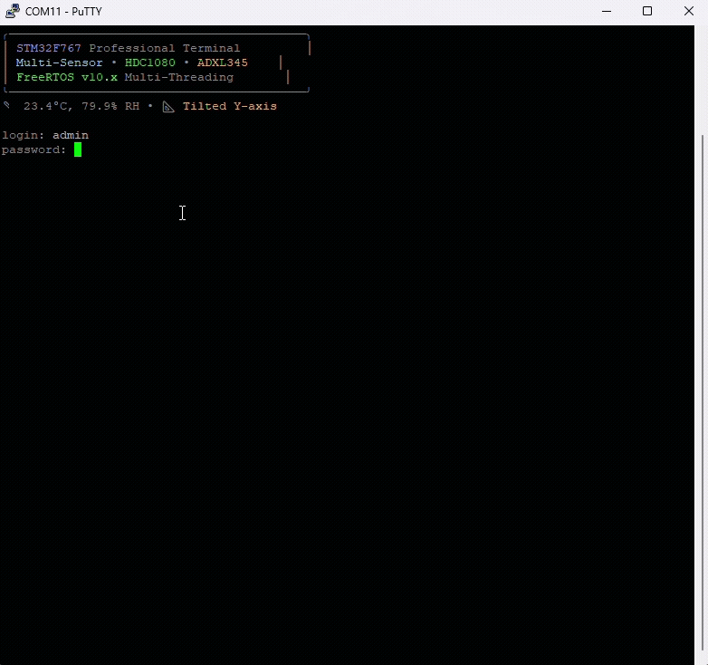

# STM32F767 Multi-Sensor Terminal

A secure, feature-rich terminal interface for STM32F767 microcontrollers with command line editing, user authentication, LED control, and comprehensive multi-sensor monitoring capabilities.

## 🎯 Project Overview

This project implements a professional terminal interface accessible via UART, featuring modern command-line editing, secure login, and comprehensive system management with real-time sensor monitoring. The terminal provides an intuitive way to interact with STM32 hardware through a familiar command-line interface.

### Key Features

- **Secure Authentication**: Username/password login system with session management, timeout protection, and comprehensive logging
- **Advanced Command Line Interface**: 
  - **TAB Auto-Completion**: Intelligent command completion with partial matching and common prefix detection
  - **Real-Time Command Validation**: Color-coded input (red=invalid, yellow=partial, green=valid) with smart multi-word command support
  - **Full Editing Support**: Cursor movement, in-line editing, character insertion/deletion, backspace, and command history navigation
  - **Professional Terminal Experience**: VT100-compatible with smooth cursor handling and responsive feedback
- **Enhanced LED Control**: 
  - Direct hardware control with timer-based auto-off functionality
  - Group/all LED control with `led on|off all` commands
  - Timer support: `led on N -t SEC` for automatic shutoff
  - Real-time status feedback and comprehensive error handling
- **Comprehensive Multi-Sensor Monitoring**: 
  - **Climate Sensor (HDC1080)**: Real-time temperature/humidity with comfort zone analysis and environmental status
  - **Accelerometer (ADXL345)**: 3-axis acceleration, tilt detection, orientation analysis, and motion sensing
  - **Live Sensor Integration**: Dynamic banner with real-time sensor data display
  - **Advanced Diagnostics**: Comprehensive testing, I2C bus scanning, and troubleshooting tools
- **Professional UI & UX**: 
  - **Color-Coded Interface**: ANSI 256-color palette for commands, status, errors, and system information
  - **Modern Terminal Aesthetics**: Clean formatting, professional banners, and structured output
  - **Responsive Design**: Immediate visual feedback and smooth user interaction
  - **Dynamic Status Display**: Live sensor data integration in startup banner
- **Robust Session Management**: 
  - Configurable session timeout with automatic logout
  - Comprehensive activity logging and authentication tracking
  - Secure password masking and input validation
- **Enterprise-Grade Architecture**: 
  - **FreeRTOS Integration**: Multi-threaded operation with proper task management
  - **Thread-Safe Operations**: Mutex-protected UART communication and shared resource access
  - **Modular Design**: Clean separation of concerns with dedicated modules for each subsystem
  - **Memory Management**: Efficient buffer usage and overflow protection

### 🎬 Live Demonstration

Watch the professional terminal interface in action! The demonstration shows the complete feature set including login, command editing, multi-sensor monitoring, and LED control:



*Experience the complete professional terminal interface including secure login, intelligent auto-completion, real-time command validation, advanced command-line editing, comprehensive multi-sensor monitoring, and enterprise-grade system management.*

## 🔧 Hardware Requirements

### Development Board
- **NUCLEO-F767ZI** development board with STM32F767ZI microcontroller
- Built-in ST-Link programmer/debugger
- USB cable for power and programming

### Sensor Hardware
- **HDC1080**: Temperature/humidity sensor (I2C address: 0x40)
- **ADXL345**: 3-axis accelerometer (I2C address: 0x53)
- **I2C Connection**: Both sensors on I2C2 bus (PF0=SDA, PF1=SCL)
- **Power**: 3.3V supply for both sensors

### Hardware Configuration
- **LEDs**: Three onboard LEDs (PB0, PB7, PB14) for status indication
- **UART**: UART4 for terminal communication
- **I2C**: I2C2 for sensor communication
- **Clock**: 216MHz system clock for optimal performance

### Terminal Access
- **Baud Rate**: 115200
- **Data Bits**: 8
- **Stop Bits**: 1
- **Parity**: None
- **Flow Control**: None

## 💻 Software Requirements

### Development Environment
- **STM32CubeIDE** version 1.8 or later
- **STM32CubeMX** for peripheral configuration
- **STM32F7 HAL Library** (managed automatically)

### Terminal Software
- **Windows**: PuTTY, Tera Term, or Windows Terminal
- **macOS/Linux**: screen, minicom, or any serial terminal
- **Cross-platform**: Arduino IDE Serial Monitor

## 🏗️ Project Architecture

### Modular Code Organization
```
Core/
├── Src/
│   ├── main.c              # Main system orchestration
│   ├── sensors.c           # Multi-sensor management (HDC1080 + ADXL345)
│   ├── terminal_ui.c       # Terminal interface and command processing
│   ├── system_logging.c    # Centralized logging system
│   ├── led_control.c       # LED management with timers
│   ├── usart.c             # UART configuration and handlers
│   ├── gpio.c              # GPIO initialization
│   ├── i2c.c               # I2C2 configuration
│   └── system_stm32f7xx.c  # System configuration
├── Inc/
│   ├── main.h              # Core definitions
│   ├── sensors.h           # Sensor interface declarations
│   ├── terminal_ui.h       # Terminal function prototypes
│   ├── system_logging.h    # Logging system interface
│   ├── system_config.h     # System-wide configuration
│   ├── led_control.h       # LED control interface
│   ├── usart.h             # UART declarations
│   ├── gpio.h              # GPIO function declarations
│   └── i2c.h               # I2C configuration
```

### Terminal Architecture

The terminal implements an advanced state machine with enhanced user experience:

#### State Management
- **LOGIN_STATE**: Username input with validation and error handling
- **PASSWORD_STATE**: Secure password input with character masking
- **AUTHENTICATED_STATE**: Full command access with intelligent editing capabilities

#### Advanced Input Processing
- **Real-Time Character Processing**: Immediate response to user input
- **Intelligent Auto-Completion**: TAB-triggered command completion system
- **Command Validation**: Live validation with visual feedback
- **Cursor Management**: Smooth cursor movement and positioning
- **History Navigation**: Up/Down arrow key support for command history
- **In-Line Editing**: Insert, delete, and modify commands at any position

#### Professional User Experience
- **Color-Coded Interface**: ANSI escape sequences for professional appearance
- **Responsive Feedback**: Immediate visual confirmation of actions
- **Error Handling**: Graceful error recovery with helpful messages
- **Session Management**: Secure timeout and activity tracking

### Command System

The terminal features an intelligent command system with advanced capabilities:

#### Auto-Completion & Validation
- **TAB Completion**: Press TAB for intelligent command completion
- **Partial Matching**: Supports partial command matching with common prefix detection
- **Multi-Match Handling**: Shows visual feedback when multiple completions are available
- **Real-Time Validation**: Commands color-coded as you type (red=invalid, yellow=partial, green=valid)
- **Smart Parameter Support**: Validates base commands even with parameters (e.g., `led on all -t 5`)

#### Available Commands

**System Management**:
- `whoami` - Display current user
- `uptime` - Show system uptime with detailed formatting
- `status` - Comprehensive system status including all subsystems
- `help` - Interactive help system with detailed command descriptions
- `logout` - Secure session termination
- `clear` - Clear terminal screen
- `history` - Show command history with navigation

**Advanced LED Control**:
- `led on|off [1-3]` - Control individual LEDs (LED1, LED2, LED3)
- `led on|off all` - Control all LEDs simultaneously
- `led on [1-3|all] -t SEC` - LED control with automatic timer-based shutoff
- Examples: `led on 1`, `led on all -t 10`, `led off 2`

**Multi-Sensor Monitoring**:
- `sensors` - Display all sensors with real-time data and status
- `climate` - Detailed temperature/humidity with comfort zone analysis
- `accel` - Comprehensive accelerometer data with orientation analysis
- Live data includes temperature, humidity, 3-axis acceleration, tilt angles, and orientation status

**Advanced Diagnostics**:
- `sensortest` - Comprehensive sensor testing and validation
- `i2cscan` - Scan I2C bus for connected devices with address discovery
- `i2ctest` - Test I2C2 peripheral configuration and communication
- `tasks` - FreeRTOS task monitoring with heap usage statistics
- `memory` - System memory analysis and usage statistics

**Log Management**:
- `logs` - Interactive log viewer with pagination and filtering
- `clear-logs` - Safe log deletion with confirmation prompt
- `confirm-clear-logs` - Confirmed log deletion command

## ⚙️ Advanced Configuration Options

### Authentication & Security
```c
#define USERNAME "admin"
#define PASSWORD "1234"
#define SESSION_TIMEOUT_MS 300000  // 5 minutes auto-logout
```

### Terminal Interface Settings
```c
#define MAX_CMD_LENGTH 32          // Maximum command length
#define HISTORY_SIZE 5             // Command history buffer
#define RX_BUFFER_SIZE 64          // UART receive buffer
```

### Auto-Completion Configuration
```c
// Valid commands array for auto-completion
static const char* valid_commands[] = {
    "help", "whoami", "clear", "history", "logout",
    "logs", "clear-logs", "confirm-clear-logs",
    "led", "status", "sensors", "uptime", "accel", 
    "climate", "i2cscan", "sensortest", "tasks"
};
```

### System Update Intervals
```c
#define SENSOR_UPDATE_INTERVAL_MS 5000    // Sensor refresh every 5 seconds
#define LED_UPDATE_INTERVAL_MS 100        // LED timer updates every 100ms
#define TERMINAL_PROCESS_INTERVAL_MS 10   // Terminal processing every 10ms
```

### Multi-Sensor Configuration
```c
// HDC1080 Climate Sensor
#define HDC1080_ADDRESS     0x40 << 1
typedef struct {
    float temperature;
    float humidity;
    uint8_t sensor_ok;
    uint32_t last_update;
} ClimateData_t;

// ADXL345 Accelerometer
#define ADXL345_ADDRESS     0x53 << 1
typedef struct {
    int16_t x_raw, y_raw, z_raw;
    float x_g, y_g, z_g;
    float magnitude;
    float tilt_x, tilt_y;
    uint8_t sensor_ok;
    uint32_t last_update;
} AccelData_t;
```

### Advanced Color System
```c
// Professional ANSI color palette
#define COLOR_SUCCESS   "\033[38;5;46m"   // Bright green for valid commands
#define COLOR_ERROR     "\033[38;5;196m"  // Bright red for errors/invalid
#define COLOR_WARNING   "\033[38;5;214m"  // Orange for partial matches
#define COLOR_INFO      "\033[38;5;81m"   // Cyan for information
#define COLOR_ACCENT    "\033[38;5;141m"  // Purple for highlights
#define COLOR_PROMPT    "\033[38;5;33m"   // Blue for prompt elements
#define COLOR_MUTED     "\033[38;5;242m"  // Gray for secondary text
#define COLOR_PRIMARY   "\033[38;5;255m"  // White for primary content
#define COLOR_RESET     "\033[0m"         // Reset to default
```

## 🚀 Getting Started

### Quick Setup Guide

1. **Hardware Preparation**: 
   - Connect NUCLEO-F767ZI development board via USB
   - Wire HDC1080 temperature/humidity sensor to I2C2 (PF0=SDA, PF1=SCL)
   - Wire ADXL345 accelerometer to I2C2 (same bus)
   - Ensure proper 3.3V power supply and I2C pull-up resistors (4.7kΩ recommended)

2. **Software Setup**: 
   - Open project in STM32CubeIDE
   - Compile with ARM GCC toolchain
   - Flash firmware to STM32F767ZI via ST-Link

3. **Terminal Connection**: 
   - Connect to virtual COM port at 115200 baud (8N1)
   - Use PuTTY, Tera Term, or any VT100-compatible terminal
   - Ensure terminal supports ANSI color codes for best experience

4. **Initial Login**: 
   - Default credentials: `admin` / `1234`
   - System will display professional banner with live sensor data
   - Type `help` to explore available commands

5. **System Validation**: 
   - Run `i2cscan` to verify sensor connectivity
   - Execute `sensortest` for comprehensive hardware validation
   - Test auto-completion by typing partial commands and pressing TAB
   - Verify LED control with `led on 1` or `led on all`

### First Commands to Try
```bash
# Basic system information
whoami
status
uptime

# Test auto-completion (press TAB)
sen<TAB>    # Completes to "sensors"
led<TAB>    # Shows LED command options

# Sensor monitoring
i2cscan
sensortest
sensors
climate
accel

# LED control examples  
led on 1
led on all -t 10
led off all

# Advanced features
tasks
history
logs
```

## 🧪 Comprehensive Testing and Validation

### Interactive Testing Commands
- **`sensortest`**: Complete diagnostic suite for HDC1080 and ADXL345 sensors
- **`i2cscan`**: Automated I2C bus scanning with device discovery and address reporting
- **`i2ctest`**: I2C2 peripheral configuration validation and communication testing
- **`sensors`**: Real-time monitoring of all sensor data with live updates
- **`climate`**: Detailed temperature/humidity analysis with comfort zone evaluation
- **`accel`**: Comprehensive accelerometer testing with tilt and orientation analysis

### Advanced Functional Testing
- **Authentication System**: Multi-level login validation, session timeout, and security logging
- **Command Line Interface**: 
  - TAB auto-completion with partial matching
  - Real-time command validation and color coding
  - Cursor movement, in-line editing, and character manipulation
  - Command history navigation and management
- **LED Control Validation**: 
  - Individual and group LED control
  - Timer-based automatic shutoff functionality
  - Status feedback and error handling
- **Multi-Sensor Integration**: 
  - Simultaneous sensor monitoring and data validation
  - Error recovery and graceful degradation
  - Live sensor data integration in UI elements

### Performance and Reliability Testing
- **Responsiveness**: Sub-10ms command processing and immediate user feedback
- **Memory Management**: Buffer overflow protection and efficient memory usage
- **Sensor Accuracy**: 5-second refresh cycles with precise timing
- **LED Precision**: 100ms timer resolution for accurate control
- **Session Stability**: Extended session testing with timeout validation
- **Concurrent Operations**: Multi-threaded FreeRTOS task coordination

### System Validation Procedures
1. **Hardware Verification**: Confirm sensor presence via `i2cscan` 
2. **Communication Testing**: Validate I2C integrity with `i2ctest`
3. **Sensor Calibration**: Run `sensortest` for comprehensive diagnostics
4. **Interface Testing**: Verify auto-completion, validation, and editing features
5. **Performance Monitoring**: Check system responsiveness and resource usage

## 📡 Advanced UART Protocol & Terminal Features

### Communication Protocol
The terminal implements a professional UART interface with advanced capabilities:
- **Baud Rate**: 115200 with 8N1 configuration for optimal performance
- **Buffer Management**: Circular buffer with 64-byte capacity and overflow protection
- **Flow Control**: Software-based with intelligent character processing

### VT100 Terminal Compatibility
- **Cursor Control**: 
  - `\033[A` (Up Arrow) - Command history navigation
  - `\033[B` (Down Arrow) - Forward history navigation  
  - `\033[C` (Right Arrow) - Cursor movement right
  - `\033[D` (Left Arrow) - Cursor movement left
- **Screen Management**: 
  - `\033[2J` (Clear entire screen)
  - `\033[K` (Clear from cursor to end of line)
  - `\033[H` (Home cursor position)
- **Advanced Positioning**: Dynamic cursor positioning for in-line editing

### Intelligent Input Processing
- **Auto-Completion**: TAB key triggers intelligent command completion
- **Real-Time Validation**: Commands validated and colored as you type
- **Character Insertion**: Insert characters at any cursor position
- **Backspace Handling**: Smart deletion with cursor repositioning
- **Password Security**: Automatic character masking for secure input

### Color System Integration
- **ANSI 256-Color Support**: Professional color palette with context-aware coloring
- **Dynamic Color Coding**: Real-time command validation with color feedback
- **Status Indicators**: Color-coded system status and sensor information
- **Error Visualization**: Clear error indication with red highlighting

## 🌡️ Sensor Features

### Climate Monitoring (HDC1080)
- **Temperature**: ±0.2°C accuracy, -40°C to +125°C range
- **Humidity**: ±2% RH accuracy, 0-100% RH range
- **Comfort Analysis**: Automatic comfort zone detection (20-25°C, 40-60% RH)
- **Status Indicators**: Color-coded comfort status (Too Hot, Too Cold, Too Dry, Too Humid)

### Motion Sensing (ADXL345)
- **Acceleration**: ±2g range, 3-axis measurement
- **Tilt Detection**: X/Y tilt angles in degrees
- **Orientation**: Automatic orientation detection (Level, Tilted, Motion)
- **Raw Data**: 16-bit resolution with LSB conversion

### Diagnostic Features
- **I2C Bus Scanning**: Automatic device discovery
- **Communication Testing**: Protocol verification
- **Error Handling**: Graceful degradation when sensors offline
- **Live Updates**: Real-time sensor monitoring

## 🔐 Enterprise-Grade Security Features

### Authentication System
- **Multi-Layer Security**: Username and password validation with configurable credentials
- **Session Management**: Secure session tokens with automatic timeout protection
- **Password Security**: Character masking during input with asterisk display
- **Activity Monitoring**: Comprehensive logging of all authentication events
- **Automatic Logout**: Configurable timeout with grace period warnings

### Input Validation & Protection
- **Buffer Overflow Protection**: Maximum command length enforcement (32 characters)
- **Command Sanitization**: Input trimming and validation before processing
- **SQL Injection Prevention**: Command parsing with safe string operations
- **Memory Protection**: Bounds checking on all buffer operations

### Audit & Logging
- **Comprehensive Event Logging**: All user actions logged with timestamps
- **Security Event Tracking**: Failed login attempts, timeouts, and suspicious activity
- **System State Logging**: Critical system events and sensor status changes
- **Log Management**: Secure log storage with deletion confirmation requirements

### Access Control
- **Role-Based Access**: Authenticated users have full system access
- **Command Authorization**: All commands require valid authentication
- **Session Validation**: Continuous session state verification
- **Privilege Escalation Prevention**: No backdoor access or privilege bypass

## 🎨 Professional UI/UX Design

### Modern Terminal Aesthetics
The terminal features a sophisticated, professional interface designed for enterprise use:

#### Visual Design Elements
- **Professional Color Palette**: ANSI 256-color support with context-aware coloring
- **Dynamic Status Indicators**: Real-time system status with color-coded feedback
- **Structured Layout**: Clean formatting with consistent spacing and alignment
- **Professional Typography**: Clear text hierarchy with appropriate emphasis

#### Interactive Features
- **Real-Time Command Validation**: Live feedback as you type with color coding
  - 🔴 **Red**: Invalid commands or syntax errors
  - 🟡 **Yellow**: Partial matches or incomplete commands  
  - 🟢 **Green**: Valid, complete commands ready for execution
- **Intelligent Auto-Completion**: TAB completion with smart matching
- **Smooth Cursor Movement**: Responsive cursor control with VT100 compatibility
- **Visual Feedback**: Immediate response to user actions

#### User Experience Enhancements
- **Startup Banner**: Professional welcome screen with live sensor integration
- **Contextual Help**: Comprehensive help system with command examples
- **Error Recovery**: Graceful error handling with helpful suggestions
- **Progress Indicators**: Visual feedback for long-running operations
- **Responsive Design**: Optimized for various terminal window sizes

#### Information Architecture
- **Hierarchical Command Structure**: Logical grouping of related commands
- **Consistent Output Formatting**: Standardized data presentation across all commands
- **Status Dashboards**: Comprehensive system overview with sensor integration
- **Interactive Elements**: User-friendly prompts and confirmation dialogs