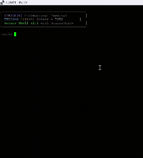

# STM32F767 Professional Terminal

A secure, feature-rich terminal interface for STM32F767 microcontrollers with command line editing, user authentication, LED control, and system monitoring capabilities.

## 🎯 Project Overview

This project implements a professional terminal interface accessible via UART, featuring modern command-line editing, secure login, and comprehensive system management. The terminal provides an intuitive way to interact with STM32 hardware through a familiar command-line interface.

### Key Features

- **Secure Authentication**: Username/password login system with session management
- **Advanced Command Line**: Full editing support with cursor movement, backspace, and command history
- **LED Control**: Direct hardware control with timer-based auto-off functionality
- **System Monitoring**: Real-time system information, uptime tracking, and activity logging
- **Professional UI**: Color-coded output with modern terminal aesthetics
- **Session Management**: Automatic timeout with configurable duration

### 🎬 Live Demonstration

Watch the professional terminal interface in action! The demonstration shows the complete feature set including login, command editing, and LED control:



*See the secure login process, advanced command-line editing with cursor movement, command history navigation, LED control with timers, and real-time system monitoring in action.*

## 🔧 Hardware Requirements

### Development Board
- **NUCLEO-F767ZI** development board with STM32F767ZI microcontroller
- Built-in ST-Link programmer/debugger
- USB cable for power and programming

### Hardware Configuration
- **LEDs**: Three onboard LEDs (PB0, PB7, PB14) for status indication
- **UART**: UART4 for terminal communication
- **Clock**: 216MHz system clock for optimal performance

### Terminal Access
- **Baud Rate**: 115200
- **Data Bits**: 8
- **Stop Bits**: 1
- **Parity**: None
- **Flow Control**: None

## 💻 Software Requirements

### Development Environment
- **STM32CubeIDE** version 1.8 or later
- **STM32CubeMX** for peripheral configuration
- **STM32F7 HAL Library** (managed automatically)

### Terminal Software
- **Windows**: PuTTY, Tera Term, or Windows Terminal
- **macOS/Linux**: screen, minicom, or any serial terminal
- **Cross-platform**: Arduino IDE Serial Monitor

## 🏗️ Project Architecture

### Code Organization
```
Core/
├── Src/
│   ├── main.c              # Main terminal logic and command processing
│   ├── usart.c             # UART configuration and handlers
│   ├── gpio.c              # GPIO initialization for LEDs
│   └── system_stm32f7xx.c  # System configuration
├── Inc/
│   ├── main.h              # Function prototypes and definitions
│   ├── usart.h             # UART declarations
│   └── gpio.h              # GPIO function declarations
```

### Terminal Architecture

The terminal implements a state machine with three main states:
- **LOGIN_STATE**: Username input and validation
- **PASSWORD_STATE**: Password input with masking
- **AUTHENTICATED_STATE**: Full command access with editing capabilities

### Command System

Available commands include:
- **System Commands**: `whoami`, `uptime`, `sysinfo`, `time`, `status`
- **LED Control**: `led on/off [1-3|all]` with optional timer (`-t SEC`)
- **Utility Commands**: `clear`, `history`, `logs`, `help`, `logout`

## ⚙️ Configuration Options

### Login Credentials
```c
#define USERNAME "admin"
#define PASSWORD "1234"
```

### Session Management
```c
#define SESSION_TIMEOUT_MS 300000  // 5 minutes
```

### Buffer Sizes
```c
#define MAX_CMD_LENGTH 32          // Maximum command length
#define RX_BUFFER_SIZE 64          // UART receive buffer
#define HISTORY_SIZE 5             // Command history entries
#define LOG_SIZE 10                // System log entries
```

### LED Configuration
```c
#define LED1_PIN GPIO_PIN_0        // Green LED
#define LED2_PIN GPIO_PIN_7        // Blue LED  
#define LED3_PIN GPIO_PIN_14       // Red LED
#define LED_PORT GPIOB             // LED port
```

## 🚀 Getting Started

1. **Hardware Setup**: Connect NUCLEO-F767ZI via USB
2. **Build Project**: Compile and flash using STM32CubeIDE
3. **Terminal Connection**: Connect to virtual COM port at 115200 baud
4. **Login**: Use credentials `admin` / `1234`
5. **Explore**: Type `help` to see available commands

## 🧪 Testing and Validation

### Functional Testing
- **Authentication**: Verify login/logout functionality
- **Command Editing**: Test cursor movement and character insertion/deletion
- **LED Control**: Confirm hardware control with timer functionality
- **Session Management**: Verify automatic timeout behavior
- **History Navigation**: Test command history with arrow keys
- **System Information**: Validate real-time data display

### Performance Testing
- **Responsiveness**: Command execution should be immediate
- **Memory Usage**: Monitor buffer usage during extended sessions
- **Timing Accuracy**: Verify LED timers and system clock precision

## 📡 UART Protocol

The terminal uses standard UART communication with VT100-compatible escape sequences for:
- **Cursor Control**: `\033[A` (Up), `\033[B` (Down), `\033[C` (Right), `\033[D` (Left)
- **Screen Control**: `\033[2J` (Clear screen), `\033[K` (Clear line)
- **Color Codes**: ANSI 256-color palette for professional appearance

## 🔐 Security Features

- **Password Masking**: Input characters displayed as asterisks
- **Session Timeout**: Automatic logout after inactivity
- **Command Logging**: All actions logged with timestamps
- **Input Validation**: Buffer overflow protection and command length limits

## 🎨 UI Design

The terminal features a modern, professional appearance with:
- **Color Coding**: Different colors for commands, status, errors, and information
- **Visual Feedback**: Command validation with color changes
- **Professional Banner**: Startup screen with system information
- **Consistent Formatting**: Structured output with clear separators